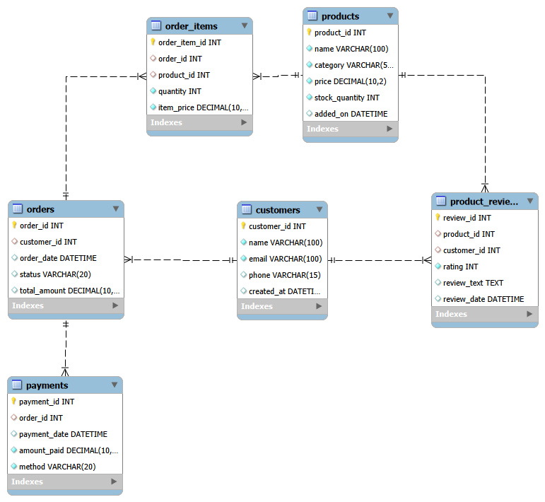
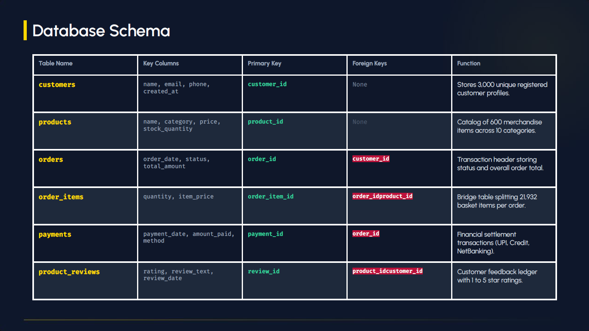
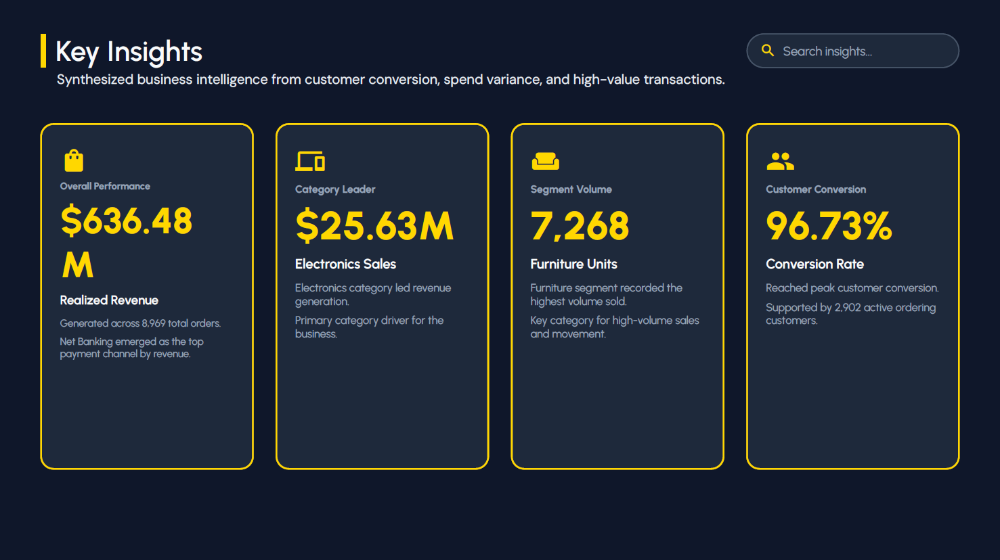

# 🛒 SQL Retail Store Analytics Portfolio

> **An end-to-end database design and business analytics project built with MySQL.**

---

# 📖 Project Overview

This project is an **end-to-end SQL-based retail analytics portfolio** designed to simulate a production-grade e-commerce database and demonstrate practical SQL and relational database skills.

The database models an e-commerce retail environment consisting of:

* 👥 **3,000 Customers**
* 📦 **600 Products**
* 🛒 **10,000 Orders**
* 🧾 **21,000+ Order Items**
* 💳 **10,000 Payment Transactions**
* ⭐ Product Reviews

The project focuses on transforming a structured relational database into meaningful **business insights using SQL**.

---

# 🎯 Project Objectives

The project was developed to demonstrate the ability to:

✔ Design a normalized relational database

✔ Build tables using DDL

✔ Populate and manipulate data using DML

✔ Establish relationships using Primary and Foreign Keys

✔ Maintain referential integrity

✔ Perform multi-table analysis using SQL Joins

✔ Use Common Table Expressions (CTEs)

✔ Apply Window Functions for advanced analytics

✔ Perform aggregations and business calculations

✔ Analyze customer, product, order, payment, and review data

✔ Answer real-world retail business questions using SQL

---

# 🛠️ Tech Stack

| Tool / Technology       | Purpose                    |
| ----------------------- | -------------------------- |
| 🐬 MySQL 8.0+           | Database Engine            |
| 🗄️ SQL                 | Data Definition & Analysis |
| 🏗️ Relational Modeling | Database Architecture      |
| 📊 EER Diagram          | Schema Visualization       |
| 🔗 Joins                | Multi-table Analysis       |
| 🧩 CTEs                 | Complex Query Organization |
| 📈 Window Functions     | Advanced Analytics         |

---

# 🏗️ Database Architecture

The database follows a **relational structure** with six core tables:

```text
customers
    │
    ├──────────────< orders
    │                    │
    │                    ├──────────────< order_items >──────────── products
    │                    │
    │                    └──────────────< payments
    │
    └──────────────< product_reviews >──────────── products
```

The schema uses:

* Primary Keys
* Foreign Keys
* Auto-Increment IDs
* Unique Constraints
* Check Constraints
* Referential Integrity
* Normalized relational design

---

# 📐 EER Diagram

<p align="center">
  
</p>

---

# 📊 Database Schema

### 👥 `customers`

Stores registered customer profiles.

**Relationship:**

`customers (1) → (N) orders`

---

### 📦 `products`

Stores product catalog information including categories, prices, and stock.

**Relationship:**

`products (1) → (N) order_items`

`products (1) → (N) product_reviews`

---

### 🛒 `orders`

Stores customer orders, order dates, statuses, and total amounts.

**Relationship:**

`orders (1) → (N) order_items`

`orders (1) → (N) payments`

---

### 🧾 `order_items`

Stores individual products and quantities associated with each order.

This table resolves the **many-to-many relationship** between orders and products.

---

### 💳 `payments`

Stores payment transactions associated with customer orders.

---

### ⭐ `product_reviews`

Stores customer ratings and written reviews for products.

---

# 🔗 Table Relationships

| Relationship                  | Cardinality | Purpose                     |
| ----------------------------- | ----------: | --------------------------- |
| `customers → orders`          |       1 : N | Customer order history      |
| `orders → order_items`        |       1 : N | Products within each order  |
| `products → order_items`      |       1 : N | Product sales across orders |
| `orders → payments`           |       1 : N | Payment transactions        |
| `products → product_reviews`  |       1 : N | Product reviews             |
| `customers → product_reviews` |       1 : N | Customer review activity    |

---

# 📊 Project Scale

| Metric          |   Scale |
| --------------- | ------: |
| 👥 Customers    |   3,000 |
| 📦 Products     |     600 |
| 🛒 Orders       |  10,000 |
| 🧾 Order Items  | 21,000+ |
| 💳 Payments     | 10,000+ |
| 🗂️ Core Tables |       6 |

---

# 📜 Database Design — DDL

The database schema is created using MySQL DDL statements.

```sql
SET FOREIGN_KEY_CHECKS = 0;
SET NAMES utf8mb4;

DROP TABLE IF EXISTS product_reviews;
DROP TABLE IF EXISTS payments;
DROP TABLE IF EXISTS order_items;
DROP TABLE IF EXISTS orders;
DROP TABLE IF EXISTS products;
DROP TABLE IF EXISTS customers;

CREATE TABLE customers (
    customer_id INT PRIMARY KEY AUTO_INCREMENT,
    name VARCHAR(100) NOT NULL,
    email VARCHAR(100) NOT NULL UNIQUE,
    phone VARCHAR(15),
    created_at DATETIME DEFAULT CURRENT_TIMESTAMP
);

CREATE TABLE products (
    product_id INT PRIMARY KEY AUTO_INCREMENT,
    name VARCHAR(100) NOT NULL,
    category VARCHAR(50) NOT NULL,
    price DECIMAL(10,2) NOT NULL CHECK (price > 0),
    stock_quantity INT NOT NULL DEFAULT 0,
    added_on DATETIME DEFAULT CURRENT_TIMESTAMP
);

CREATE TABLE orders (
    order_id INT PRIMARY KEY AUTO_INCREMENT,
    customer_id INT,
    order_date DATETIME DEFAULT CURRENT_TIMESTAMP,
    status VARCHAR(20) DEFAULT 'Pending',
    total_amount DECIMAL(10,2),
    FOREIGN KEY (customer_id) REFERENCES customers(customer_id)
);

CREATE TABLE order_items (
    order_item_id INT PRIMARY KEY AUTO_INCREMENT,
    order_id INT,
    product_id INT,
    quantity INT NOT NULL CHECK (quantity > 0),
    item_price DECIMAL(10,2) NOT NULL,
    FOREIGN KEY (order_id) REFERENCES orders(order_id),
    FOREIGN KEY (product_id) REFERENCES products(product_id)
);

CREATE TABLE payments (
    payment_id INT PRIMARY KEY AUTO_INCREMENT,
    order_id INT,
    payment_date DATETIME DEFAULT CURRENT_TIMESTAMP,
    amount_paid DECIMAL(10,2) NOT NULL,
    method VARCHAR(20) NOT NULL,
    FOREIGN KEY (order_id) REFERENCES orders(order_id)
);

CREATE TABLE product_reviews (
    review_id INT PRIMARY KEY AUTO_INCREMENT,
    product_id INT,
    customer_id INT,
    rating INT NOT NULL CHECK (rating BETWEEN 1 AND 5),
    review_text TEXT,
    review_date DATETIME DEFAULT CURRENT_TIMESTAMP,
    FOREIGN KEY (product_id) REFERENCES products(product_id),
    FOREIGN KEY (customer_id) REFERENCES customers(customer_id)
);
```

---

# 🧠 SQL Concepts Demonstrated

## 🏗️ Database Design

* Relational Database Design
* Normalization
* Primary Keys
* Foreign Keys
* Referential Integrity
* Constraints
* Auto-Increment Identifiers

## 🔎 SQL Analysis

* `SELECT`
* `WHERE`
* `GROUP BY`
* `HAVING`
* `ORDER BY`
* Aggregate Functions
* Conditional Logic
* Multi-Table Joins
* Subqueries
* Set Operations

## 🚀 Advanced SQL

* Common Table Expressions (CTEs)
* Window Functions
* `ROW_NUMBER()`
* Partitioned Calculations
* Ranking
* Running / Comparative Analysis

---

# 📊 Presentation & Analysis

The project also includes a presentation covering the database structure and SQL business analytics.

## Slide Preview

<p align="center">
  
  
</p>

### 📄 Full Presentation

[**View SQL Retail Store Analytics Portfolio Deck**](docs/SQL_Retail_Store_Portfolio_Deck.pdf)

---

# 💡 Business Analytics

The SQL queries are designed to answer practical retail business questions involving:

* 💰 Revenue & Sales Performance
* 🛒 Order Analysis
* 👥 Customer Behavior
* 📦 Product Performance
* 💳 Payment Analysis
* ⭐ Customer Reviews
* 📈 Ranking & Comparative Analysis
* 📊 Operational Performance

The project moves beyond basic SQL syntax and focuses on using SQL to **solve business problems and generate actionable insights**.

---

# 📈 Skills Demonstrated

🗄️ **Relational Database Design**

🐬 **MySQL**

📜 **DDL & DML**

🔗 **SQL Joins**

🧩 **CTEs**

📊 **Aggregate Functions**

📈 **Window Functions**

🏆 **Ranking & Comparative Analysis**

🔐 **Constraints & Referential Integrity**

📐 **EER Modeling**

💡 **Business Analytics**

📖 **Data Storytelling**

---

# 📁 Repository Structure

```text
da-project-02-sql-retail-store-analytics
│
├── docs
│   ├── eer_diagram.png
│   ├── slide_preview_1.png
│   ├── slide_preview_2.png
│   └── SQL_Retail_Store_Portfolio_Deck.pdf
│
├── sql
│   ├── database_schema.sql
│   ├── data_insertion.sql
│   └── analytics_queries.sql
│
├── README.md
└── LICENSE
```

---

# 🚀 Project Journey

### Project #02 — SQL Retail Store Analytics

This project represents the next stage of my **Data Analytics journey**, moving from spreadsheet-based analysis into relational database design and advanced SQL analytics.

### Project #01

📊 **Excel Sales Intelligence Dashboard**

### Project #02

🛒 **SQL Retail Store Analytics Portfolio** ✅

My current skill set includes:

**Excel → SQL → Statistics → Power BI → Python**

More real-world Data Analytics projects coming soon. 🚀

---

# 👨‍💻 About Me

Hi, I'm **Bhanu Pratap Singh** 👋

I'm an aspiring **Data Analyst** passionate about using data to uncover insights, solve business problems, and build meaningful analytical solutions.

### 💻 Skills

**Excel • SQL • Statistics • Power BI • Python**

---

# 🔗 Connect With Me

* 💼 **LinkedIn:** [Bhanu Pratap Singh](https://www.linkedin.com/in/bhanupratapsinghj)
* 📧 **Email:** [bps53260@gmail.com](mailto:bps53260@gmail.com)

---

# ⭐ Support

If you found this project interesting, consider giving the repository a **⭐ Star**.

It motivates me to keep building and sharing more Data Analytics projects.
